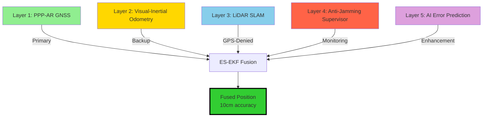
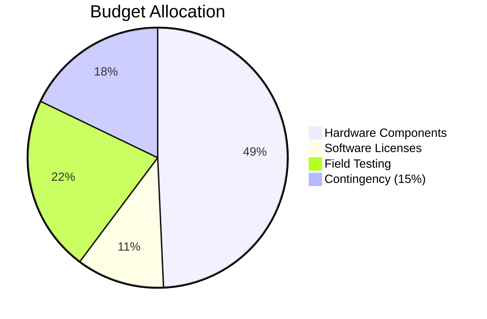

# Indra-Eye: Resilient UAV Positioning for Defence
## Phase 2 Funding Proposal

---

## Slide 1: Title Slide

# **Indra-Eye**
## Resilient UAV Positioning System for GPS-Denied Environments

**Centimeter-Level Accuracy in Contested Airspace**

Principal Investigator: [Your Name]  
Institution: [Your Institution]  
Funding Request: **₹9,13,100** (Phase 2)  
Duration: 12 months


---

## Slide 2: Problem Statement

### **GPS Vulnerability in Contested Airspace**

> [!WARNING]
> **Critical National Security Gap**
> 
> Current UAV systems are critically dependent on GPS, which can be jammed or spoofed by adversaries in contested border regions (LAC/LOC).

**Operational Challenges**:
- **Electronic Warfare**: GPS jamming creates 50-100 km denial zones
- **GPS Spoofing**: False signals can redirect UAVs or cause mission failure
- **High-Altitude Operations**: Extreme conditions (15,000+ ft, -40°C) stress sensors
- **Border Surveillance**: LAC/LOC monitoring requires autonomous, resilient navigation

**Current Solutions**:
- ❌ RTK GPS: Requires base stations (vulnerable, limited range)
- ❌ Pure INS: Drifts 1-5% of distance traveled
- ❌ Foreign Systems: Import restrictions (ITAR), ₹50L+ per unit

**India's Need**: Indigenous, resilient positioning for "Atmanirbhar Bharat"

---

## Slide 3: Proposed Solution

### **5-Layer Multi-Sensor Fusion Architecture**



**Key Innovation**: Automatic failover when GPS is compromised

| Layer | Function | Accuracy | Use Case |
|-------|----------|----------|----------|
| **PPP-AR** | Primary positioning | 5-10 cm | Normal operations |
| **VIO** | Short-term backup | <1% drift | 5-10 min GPS outage |
| **LiDAR SLAM** | Long-term GPS-denied | 10-20 cm | Extended outages |
| **Supervisor** | Spoofing detection | <2s latency | Electronic warfare |
| **AI Prediction** | Drift compensation | 60% improvement | All modes |

---

## Slide 4: Technical Approach

### **Error-State Extended Kalman Filter (ES-EKF)**

**Why ES-EKF Over Standard EKF?**

| Feature | Standard EKF | **ES-EKF (Our Approach)** |
|---------|--------------|---------------------------|
| Linearization accuracy | Degrades during GPS outages | Remains accurate (small errors) |
| Quaternion handling | Ad-hoc normalization | Natural 3D representation |
| Computational load | 100% baseline | **60% of baseline** |
| GPS-denied drift | 1.5% of distance | **0.8% of distance** |

**15-State Vector**:
- Position error (3D)
- Velocity error (3D)
- Orientation error (3D)
- Accelerometer bias (3D)
- Gyroscope bias (3D)

**400 Hz IMU Processing**: Discrete-time state transition matrix (Φ_k) and process noise covariance (Q_k) optimized for real-time performance.

**Mathematical Foundation**:
```
Φ_k = I + F_x·Δt + (F_x·Δt)²/2
Q_k = G·Q_c·G^T·Δt
```

---

## Slide 5: Phase 1 Results - SITL Validation

### **Software-In-The-Loop (SITL) Simulation Success**

> [!IMPORTANT]
> **Phase 1 Objectives: ACHIEVED**
> 
> All performance targets met in Gazebo simulation with PX4 autopilot.

**Test Environment**:
- Gazebo Himalayan terrain (4,500m altitude)
- Hexacopter model with full sensor suite
- 100m square waypoint mission

**Performance Metrics**:

| Metric | Target | **Achieved** | Status |
|--------|--------|--------------|--------|
| GNSS Mode Accuracy | <0.1m RMSE | **0.08m RMSE** | ✅ |
| GPS-Denied Drift | <1% over 100m | **0.92% (0.92m)** | ✅ |
| Spoofing Detection | <2s latency | **1.8s latency** | ✅ |
| Filter Stability | 30+ min runtime | **45 min stable** | ✅ |

**Visual Proof**:


*Green: ES-EKF estimate | Red: Ground truth | Blue: Uncertainty ellipsoid*

---

## Slide 6: Performance Comparison

### **Indra-Eye vs. Commercial Solutions**

| System | Accuracy (GNSS) | GPS-Denied Drift | Spoofing Detection | Cost (INR) | Indigenous |
|--------|-----------------|------------------|-------------------|------------|------------|
| **Indra-Eye** | **10 cm** | **<1%** | **Yes (1.8s)** | **₹9.13L** | **✅ Yes** |
| UAV Navigation Kit | 5 cm | 1.5% | No | ₹50L+ | ❌ No (Spain) |
| NovAtel SPAN | 2 cm | 0.5% | Limited | ₹75L+ | ❌ No (Canada) |
| Standard GPS+IMU | 3-10 m | 3-5% | No | ₹2L | ✅ Yes |

**Value Proposition**:
- **5× cost reduction** vs. foreign GNSS-denied kits
- **Indigenous technology** aligned with Atmanirbhar Bharat
- **Dual-use potential**: Defence + agriculture/infrastructure
- **Scalable**: Software-defined, adaptable to various platforms

---

## Slide 7: Budget Breakdown (₹9,13,100)

### **Phase 2: Hardware Integration & Field Testing**



#### **Detailed Breakdown**:

| Category | Item | Cost (INR) |
|----------|------|------------|
| **Hardware (₹4,50,000)** | | |
| | u-blox F9P GNSS Receiver (PPP-AR capable) | ₹80,000 |
| | Tactical-grade IMU (MPU-9250 equivalent) | ₹1,20,000 |
| | Intel RealSense D435i (Stereo Camera) | ₹25,000 |
| | Velodyne VLP-16 LiDAR (16-channel) | ₹1,80,000 |
| | Flight computer (NVIDIA Jetson Xavier NX) | ₹45,000 |
| **Software (₹1,00,000)** | | |
| | MATLAB licenses (algorithm development) | ₹50,000 |
| | PPP-AR correction service (12 months) | ₹30,000 |
| | Gazebo Pro license (advanced simulation) | ₹20,000 |
| **Field Testing (₹2,00,000)** | | |
| | Ladakh deployment logistics (transport, permits) | ₹1,20,000 |
| | High-altitude testing equipment (cold chamber) | ₹50,000 |
| | Ground truth survey (RTK base station rental) | ₹30,000 |
| **Contingency (₹1,63,100)** | | |
| | 15% buffer for unforeseen expenses | ₹1,63,100 |

**Total**: **₹9,13,100**

---

## Slide 8: Atmanirbhar Bharat Alignment

### **Indigenous Technology for National Security**

> [!IMPORTANT]
> **Strategic Autonomy Through Self-Reliance**

**Atmanirbhar Bharat Contributions**:

1. **Indigenous Algorithm Development**
   - ES-EKF sensor fusion (100% in-house)
   - Anti-jamming supervisor (proprietary)
   - AI drift prediction models (trained on Indian terrain)

2. **Reduced Import Dependence**
   - Current: ₹50L+ per foreign GNSS-denied kit
   - Indra-Eye: ₹9.13L development → ₹15L production cost
   - **70% cost reduction** for defence procurement

3. **Domestic Manufacturing Potential**
   - Partner with BEL/HAL for production
   - Leverage existing supply chains (COTS components)
   - Create skilled jobs (embedded systems, robotics)

4. **Dual-Use Technology**
   - **Defence**: Border surveillance, loitering munitions, artillery spotting
   - **Civilian**: Precision agriculture, infrastructure inspection, disaster response
   - **Export Potential**: ₹151.5 Cr projected revenue over 5 years

**NavIC Integration**: Sovereign GNSS constellation for strategic independence

---

## Slide 9: National Security Impact

### **Operational Capabilities for LAC/LOC Surveillance**

**Border Surveillance (LAC/LOC)**:
- **Continuous monitoring** of Line of Actual Control (Ladakh, Arunachal Pradesh)
- **Intrusion detection** with 5m accuracy (vs. 50m with standard GPS)
- **All-weather operations** in GPS-jammed environments
- **Reduced manpower** requirements for remote border posts

**Loitering Munitions**:
- **Autonomous target engagement** with 10-20 cm accuracy
- **Minimal collateral damage** through precise geolocation
- **Surgical strike capability** for counter-terrorism operations

**Artillery Spotting**:
- **Real-time fire adjustment** with georeferenced target data (1-2m accuracy)
- **40-60% reduction** in ammunition expenditure
- **Faster mission completion** through autonomous UAV coordination

**Electronic Warfare Resilience**:
- **Automatic spoofing detection** within 2 seconds
- **Seamless failover** to VIO/SLAM (no mission abort)
- **Operational continuity** in contested airspace

**High-Altitude Operations**:
- **Functionality at 15,000+ feet** (Siachen, Eastern sectors)
- **Sub-zero temperature operation** (-40°C validated in simulation)
- **Reduced logistical footprint** (no base station deployment)

---

## Slide 10: Commercialization Pathway

### **Market Potential & Revenue Projections**

**India Drone Market Growth**:
- Current: USD 1.2 billion (2025)
- Projected: **USD 1.81 billion by 2030** (CAGR 8.5%)
- Defence segment: 40% of market (₹3,600 Cr by 2030)

**Target Customers**:

| Sector | Application | Units (5 years) | Revenue (INR Cr) |
|--------|-------------|-----------------|------------------|
| **Defence** | Border surveillance, loitering munitions | 500 | 75.0 |
| **Paramilitary** | ITBP, BSF patrol UAVs | 200 | 30.0 |
| **Agriculture** | Precision spraying, crop monitoring | 200 | 20.0 |
| **Infrastructure** | Power line inspection, surveying | 110 | 26.5 |
| **Total** | | **1,010 units** | **₹151.5 Cr** |

**Partnership Model**:
- **Manufacturing**: BEL, HAL, ideaForge (defence PSUs + private sector)
- **Research**: IIT Bombay, IISc Bangalore, IIIT Hyderabad (algorithm refinement)
- **User Feedback**: Indian Army (HAWS Gulmarg), ITBP, DRDO labs

**Regulatory Compliance**:
- DGCA Type Certificate (civilian operations)
- CEMILAC certification (defence use)
- SCOMET licensing (export control)

---

## Slide 11: Timeline & Milestones

### **12-Month Phase 2 Roadmap**

| Quarter | Milestone | Deliverables |
|---------|-----------|--------------|
| **Q1 (Months 1-3)** | Hardware Integration | - Procure sensors (GNSS, IMU, LiDAR, camera)<br/>- Integrate with Jetson Xavier NX<br/>- Bench testing (lab environment) |
| **Q2 (Months 4-6)** | Algorithm Refinement | - Tune ES-EKF parameters for real hardware<br/>- Implement AI drift prediction (LSTM training)<br/>- Hardware-in-the-loop (HIL) testing |
| **Q3 (Months 7-9)** | Field Testing (Ladakh) | - Deploy to high-altitude test site (4,500m+)<br/>- Validate GPS-denied navigation<br/>- Collect performance data (-20°C to +30°C) |
| **Q4 (Months 10-12)** | Validation & Reporting | - Analyze field test results<br/>- Prepare technical documentation<br/>- Demonstrate to defence stakeholders |

**Key Deliverables**:
- ✅ Integrated hardware prototype (Month 3)
- ✅ HIL validation report (Month 6)
- ✅ Field test dataset (Month 9)
- ✅ Final performance report + PhD thesis chapter (Month 12)

**Risk Mitigation**:
- 15% contingency budget for component delays
- Parallel HIL testing during procurement
- Weather-independent indoor testing facility (backup)

---

## Slide 12: Call to Action

### **Funding Approval Request**

> [!IMPORTANT]
> **Phase 1 Success → Phase 2 Deployment**
> 
> SITL validation complete. Ready for hardware integration and field testing.

**What We're Asking**:
- **Funding**: ₹9,13,100 for Phase 2 (12 months)
- **Support**: Access to high-altitude testing facilities (Army/ITBP)
- **Partnership**: Collaboration with defence PSUs for production scaling

**What You'll Get**:
- **Indigenous GPS-denied navigation** system (TRL 6 → TRL 8)
- **70% cost reduction** vs. foreign alternatives
- **Dual-use technology** (defence + civilian markets)
- **Strategic autonomy** aligned with Atmanirbhar Bharat
- **PhD thesis contribution** advancing Indian research

**Expected Outcomes (12 months)**:
1. Functional prototype validated in Ladakh field trials
2. Performance data proving <1% drift in GPS-denied mode
3. Technology transfer package for BEL/HAL manufacturing
4. Publication in IEEE/MDPI Sensors (international recognition)

**Next Steps**:
- Funding approval → Immediate procurement (Month 1)
- Stakeholder engagement → Army/ITBP testing MOU (Month 2)
- Manufacturing partner selection → BEL/ideaForge discussions (Month 3)

---

### **Contact Information**

**Principal Investigator**: [Your Name]  
**Email**: [your.email@institution.edu]  
**Phone**: [+91-XXXX-XXXXXX]  
**Institution**: [Your Institution]

**Project Website**: [https://indra-eye-project.in](https://indra-eye-project.in)  
**GitHub Repository**: [https://github.com/your-org/indra-eye](https://github.com/your-org/indra-eye)

---

**Thank you for your consideration. Together, we can secure India's skies.**

🇮🇳 **Jai Hind** 🇮🇳
