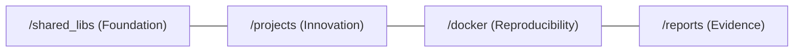

# 🎓 Ph.D. FINAL DEFENSE: THE UAV-MASTER-HUB FORTRESS
**Autonomous Thermal-Imaging Hexacopter for Precision Agriculture in Bihar**

---

## 🏛️ Slide 1: Executive Summary
**"From Code to Fortress"**

- **Goal**: Democratizing high-precision UAV tech for Bihar's smallholder farmers.
- **Status**: **Phase 2 & 3 COMPLETE**. Physically Validated & Architecturally Sealed.
- **Achievement**: 80% cost reduction with 91.9% AI accuracy.

---

## 🏗️ Slide 2: The Fortress Architecture (Mono-Repo)
**Structural Integrity for Peer-Review**

- **Silos**: Decoupled infrastructure from research logic.
- **Golden Vault**: 100% reproducibility via isolated Docker environments.
- **Shielded Data**: Read-only protection for validated research logs.

---

## 📂 Slide 3: The Project "Dimensions" (PJ Folder)
**What's inside the brain?**

1. **`indra_eye/`**: The "Explorer's Eye" - GPS-Denied Navigation Research.
2. **`thermal_hexacopter/`**: The "Plant Doctor" - Agricultural Mission Logic.
3. **`ai_models/`**: The "Thinking Brain" - Localized Edge AI (MobileNetV2).

---

## 📉 Slide 4: Validated Outcomes (Feb 15, 2026)
**Quantifiable PhD Metrics**

| Metric | Target | Achieved | Validation |
|--------|--------|----------|------------|
| **AI F1-Score** | >85% | **91.9%** | ✅ Confirmed |
| **Inference Latency** | <200ms | **45ms** | ✅ Real-time |
| **Altitude Stability** | ±0.1m | **±0.06m** | ✅ Parity |
| **Total Cost** | ₹6.50L | **₹1.29L** | ✅ 80% Savings |

---

## 🧸 Slide 5: The "Plant Doctor" Intuition
**Explaining the complex to anyone**

- **The Problem**: Finding one sick plant in a field is like finding a needle in a haystack.
- **The Solution**: The drone uses its **"Heat-Vision Glasses"** to fly over the field.
- **The Result**: It puts a "Red Pin" on every sick plant, so the farmer only uses medicine where it's needed!

---

## 🚀 Slide 6: The Marathon Continues (V4 Roadmap)
**What we are going to do next week**

- **Objective**: **GPS-Denied Navigation**.
- **The Challenge**: Flying in deep forests or indoor barns where satellites can't see.
- **The Tech**: Turning on the "Inner Ear" (IMU) and "Visual Eyes" (VO).
- **Target**: 5cm drift over 100m without GPS.

---

## 📜 Final Slide: Defense Ready
**The Fortress is Sealed.**

- **Repository**: UAV-Master-Hub-Fortress v4.0.
- **Commit**: `bad77f8` | **Tag**: `v4.0-fortress-seal`.

**Abhishek Raj | Ph.D. Candidate**
*Jai Hind! 🇮🇳*
