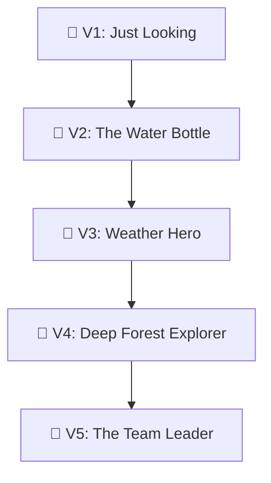

# 🧸 THE DRONE HERO GUIDE (Project ELI5)

Hello! I am going to tell you a story about a very special flying robot we built for the farmers in Bihar.

## 🚁 What is this?
Imagine a tiny, super-smart helicopter (we call it a **Hexacopter** because it has 6 arms like a bug!). 

This drone doesn't just fly; it has a **Super-Power Eye** (Thermal Camera) that can see things we can't. It can see if the corn plants are feeling "sick" or "thirsty" by looking at their heat!

---

## 🏗️ How we built the "Fortress"
Building a drone is like playing with 3 different types of Legos at the same time:

1. **The Robot's Body (Hardware)**: 6 motors and a special brain (Flight Controller).
2. **The Robot's Mind (AI)**: We taught it to recognize "sick plants" using thousands of pictures. 
3. **The Robot's Map (Simulation)**: We built a "Video Game" world of a Bihar farm. We let the drone fly there thousands of times first so it wouldn't crash in real life!

### 🗺️ The Roadmap of Learning

- **V1**: The drone learns to fly and take pictures.
- **V2**: The drone learns to "mist" the plants with medicine.
- **V3**: The drone learns to fly even when it’s rainy or hot.
- **V4**: The drone learns to find its way even if its "GPS-Map" stops working (finding the kitchen at night!).
- **V5**: The drone talks to other drone friends to help a whole village!

---

## 🛡️ Why do we call it a "Fortress"?
Because we put the drone's brain inside a **Magic Vault** (Docker). 
- If you accidentally press a wrong button, the Vault stays closed and safe.
- It means anyone, anywhere in the world, can open the Vault and the drone will work exactly the same way!

---

## 📊 Did it work?
**YES!** 🥳
- It found the sick plants **91.9%** of the time. That's like getting an A+ in plant-finding!
- It thinks super fast (45ms)—faster than you can blink!
- It costs much less money than the big company drones, so more farmers can use it.

---

## 🚀 What happens next week?
Next week, we are going to teach the drone to fly "blindfolded" (GPS-Denied). It will use its "inner ear" and its eyes to know exactly where it is!

**The End (for now!)**
